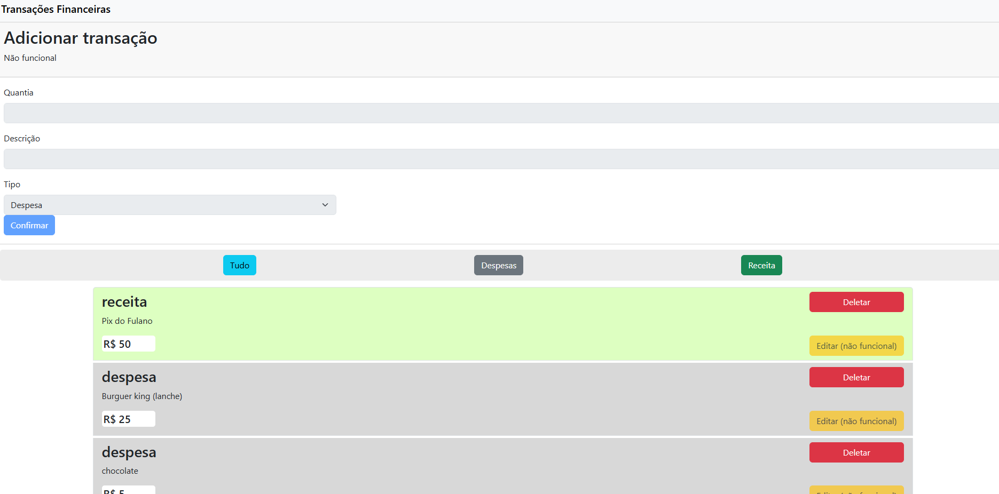

Desafio Técnico: CRUD de Transações Financeiras
Este projeto é um sistema de gerenciamento de transações financeiras com funcionalidades de Cadastro, Leitura, Atualização e Exclusão (CRUD). O backend é desenvolvido em Laravel e o frontend em Angular.

🚀 Como Rodar o Backend
Pré-requisitos:
-Baixe e instale o PHP em: https://www.php.net/downloads.php
-Baixe e instale o Composer em: https://getcomposer.org/
-Baixe o arquivo de criação do banco de dados e salve na pasta DT-CRUD/banco.

Inicialize o XAMPP:
-Ative os módulos Apache e MySQL.

Importe o Banco de Dados:
-Acesse: http://localhost/phpmyadmin/
-Vá em Banco de Dados > Importar.
-Selecione o arquivo salvo na pasta banco e clique em Importar.

Inicie o Servidor Laravel:
-Acesse a pasta DT-CRUD/backend.
-No terminal, rode o comando: php artisan serve
-Pronto! O backend estará rodando em http://localhost:8000.

🎨 Como Rodar o Frontend
Pré-requisitos:
-Baixe e instale o Node.js.
-Instale o Angular CLI:
-No terminal, rode o comando: npm install -g @angular/cli

Inicie o Frontend:
-Acesse a pasta DT-CRUD/frontend.
-No terminal, rode o comando: ng serve
-Pronto! O frontend estará rodando em http://localhost:4200.

📌 Considerações
O projeto ainda está inacabado, faltando a integração entre o backend e o frontend.
O backend está completamente funcional, enquanto o frontend conta com um protótipo inicial que demonstra a interface planejada.
Aprendizado: Apesar do curto tempo disponível, o projeto foi uma excelente oportunidade de estudo, permitindo-me aprender bastante sobre backend com Laravel e frontend com Angular.

